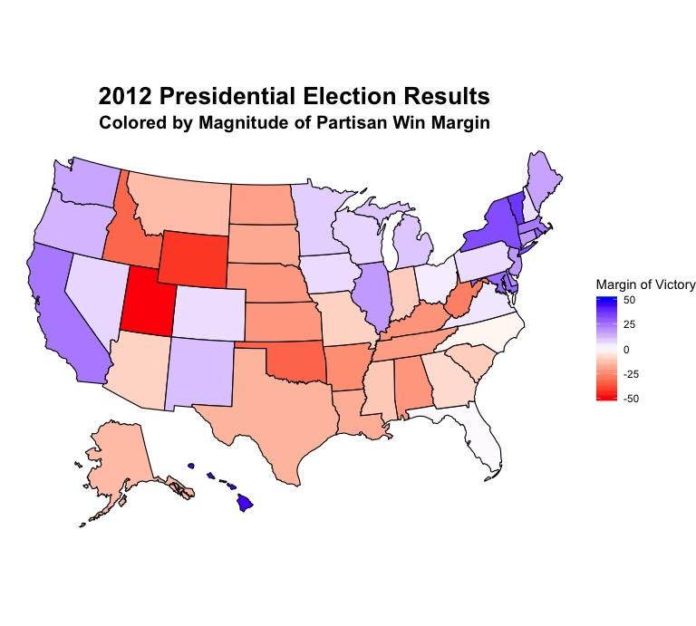

# 09.12 - What's in a Swing State?

Like many aspects of American politics and society, the system through which Americans elect their leader is fundamentally different from much of the rest of the world. Called the [electoral college](https://en.wikipedia.org/wiki/United_States_Electoral_College), the system allots each state's electoral votes to a given candidate based on the winner of each state's popular vote, and a candidate needs at least half of the 538 electoral votes to win. Generally, the majority of states tend to vote for the same partisan candidate every four years, with some famous examples of "deep-blue" states like Massachusetts and California and "deep-red" states like Mississipi and Texas. However, much political and journalistic focus has been placed on the notion of "swing states," which are states where winners tend to have small margins of victory (< 5 percentage points) and are thus considered the most important states for a candidate to campaign in and win. 

In 2020, things are no different. News outlets from [Politico](https://www.politico.com/news/2020/09/08/swing-states-2020-presidential-election-409000) to [FiveThirtyEight](https://projects.fivethirtyeight.com/swing-states-2020-election/) have reported on the possibility of the elecoral map "shifting" as a result of [shifting demographics](https://www.theatlantic.com/politics/archive/2019/10/swing-state-demographics-2020-presidential-election-the-politics-daily/600706/), [political realignment](https://www.theatlantic.com/ideas/archive/2019/04/will-2020-bring-realignment-left/586624/), or the unique conditions created by the COVID-19 pandemic. There's still a lot we don't know, but we can probably draw some substantive conclusions through analysis of the last few elections. Which states have been the most competitive in the past few elections? Which states seem to be gradually shifting away from one party and towards the other? Are states that happened to "swing" from Democrats to Republicans in 2016 such as Pennsylvania, Florida, and Wisconsin going to continue moving in that direction? 

To get a sense of which states have been the most competitive in the past few election cycles, let's take a look at the margins of victory in all 50 states for the past two elections, which were in 2012 and 2016 (Note: for some reason, Colorado does not fill in correctly on either map. In 2012 and 2016, it was won by the Democratic candidate). In both maps, a darker shade of red or blue signals a high margin of victory for either the Republican or Democratic candidate, and a very light color indicates a small margin of victory. Thus, the states that are white or a very light blue/red were that year's swing states. The maps don't look very difference at first glance, and the most noticable difference might be the light red shading of Michigan, Pennsylvania, and Wisconsin on the 2016 map as opposed to the fairly blue coloration on the 2012 map. In [coverage of the 2016 election](https://www.washingtonpost.com/graphics/politics/2016-election/swing-state-margins/), those three states are commonly referred to as the swing states that gave Trump a "path to victory." However, we still can't tell exactly which states have made significant shifts in partisan presidential preference from this map alone.

2012            |  2016
:-------------------------:|:-------------------------:
  |  

Mapping each state's 

2012 Swing States            |  2016 Swing States
:-------------------------:|:-------------------------:
  |  
