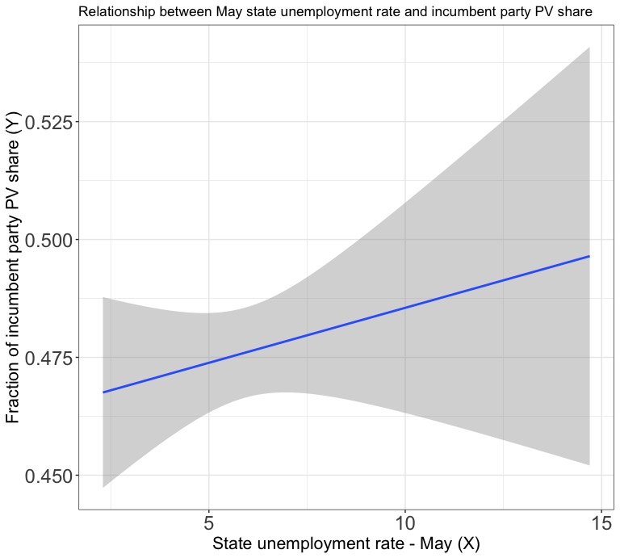

# 09.19 - The Economy: National vs. Local Models
## Introduction
In August, a Pew Research Center poll found that [the economy was the top issue for voters in the upcoming 2020 election](https://www.pewresearch.org/politics/2020/08/13/important-issues-in-the-2020-election/). Economic variables have long been used in political forcasting to predict the outcomes of elections, and in this post I'll be examining economic & presidential election data to examine the following question: are models that use national economic data better at predicting the outcome of national elections than models that use state or local economic data? Further, is unemployment a good predictor comapred to another economic variable such as GDP growth? **Using state and national popular vote and GDP/unemployment data, I created three models using national GDP growth, national unemployment rate, and state unemployment rates as predictor variables and ultimately find that the models using national and state unemployment rates to predict incumbent party popular vote share show statistically insignificant relationships between the predictor and outcome variables.**

## Model 1 - Q2 GDP Growth
To start, I replicated the fairly standard Q2 GDP growth model that we've been spending a lot of time talking about in class. While Q2 GDP growth is an indirect way to measure the impact of economic conditions in the United States, it's a fairly common predictor variable [in many professional election models](https://projects.economist.com/us-2020-forecast/president/how-this-works), and the correlation between Q2 GDP growth and incumbent party popular vote share is fairly high at .57. Below, see a plot of the regression line from a model where Q2 GDP growth is the predictor variable and incumbent party popular vote share is the outcome variable.

 A closer look at some of the model's other outputs shows that the Q2 GDP growth variable has a statistically significant p-value of .0133 and an adjusted R-squared value of .284, indicating that the model can predict around 28% of the variation in the outcome variable. A look at a [plot of the residuals](https://raw.githubusercontent.com/parkermas/gov1347-blog/gh-pages/m1_residuals.jpeg) shows no clear pattern that would indicate a flaw in the model. A This isn't great, but it isn't too bad for a very simple model that uses only one variable to predict an outcome that is driven by a far more complicated reality. **Ultimately, this model predicts that Donald Trump will recieve 21.3% of the popular vote in the 2020 election.**

## Model 2 - Q2 National Unemployment Rate
Next, I created a new model using a predictor variable that is [frequently discussed in coverage of the 2020 election](https://www.politico.com/news/2020/08/06/trump-economic-recovery-election-392497), especially amid the COVID-19 crisis: the national unemployment rate. However, a quick look at the correlation between Q2 national unemployment rate and the incumbent party popular vote share shows one that is extremely low, with a value of .0067. Below, see a plot of the regression line from a model where Q2 unemployment rate is the predictor variable and incumbent party popular vote share is the outcome variable.

The coefficient of the Q2 unemployment variable is actually slightly positive (.02), which makes very little sense in the context of reality. Why would an incumbent recieve **more** support in an election when the unemployment rate is higher? A closer examination of the model's very high and statistically insignificant p-value of .979 and very low adjusted R-squared value of -.06 reveals that national unemployment is a very poor predictor variable for incumbent party popular vote share. A look at a [graph of the residuals](https://raw.githubusercontent.com/parkermas/gov1347-blog/gh-pages/m2_residuals.jpeg) also shows a very clear horizontal line pattern that confirms the poor quality of the model. **Regardless of its poor quality, this model predicts that Donald Trump will recieve 52.2% of the popular vote in the 2020 election.**

## Model 3 - May State Unemployment Rates
In the realm of national economic indicators, it's pretty clear that GDP does a much better job of predicting election results than unemployment rate. However, what about using state unemployment rates as predictor variables instead? To do this, I used the state unemployment data provided by the course staff and [presidential election state returns data](https://dataverse.harvard.edu/dataset.xhtml?persistentId=doi:10.7910/DVN/42MVDX) from the MIT Election Lab to create a dataset that could compare popular vote share and unemployment rate on a state level. However, a check of the correlation between unemployment rate and incumbent party popular vote share already casts doubt on this model, as it has a value of 0.039. Below, see a plot of the regression line from a model where unemployment rate is the predictor variable and incumbent party popular vote share is the outcome variable.

Unfortunately, the statistically p-value of the popular vote share variable and the very low adjusted R-squared value of -0.00025 suggest that this model is just as weak as the model that used national unemployment rates instead of state unemployment rates, and [this plot](https://raw.githubusercontent.com/parkermas/gov1347-blog/gh-pages/m4_residuals.jpeg) of the residuals confirms this through a pronounced pattern in the plotted points. **Even though it is not a real improvement over the last model, this model predicts that Donald Trump will recieve 49.1% of the popular vote in the 2020 election.** 

## Conclusion
Let's take a look at a summary of the three models. 

As we can see, the Q2 GDP model is by far the best of the three in terms of p-value, correlation between variables, and adjusted R-squared value. Because the state unemployment rate model has a higher (but still significantly insignificant) p-value and a slightly stronger correlation between variables versus the national unemployment rate mode, it might seem to be a better model overall. However, it has a lower adjusted-R squared value (indicating that it can predict an even smaller range of the outcomes), casting this into doubt. Ultimately, it doesn't really matter -- both models are bad. But why is the more local state unemployment rate variable not inherently a better predictor than the national variable, and why does unemployment seem to be a bad predictor generally?

There's no way to know for sure, but political scientists have studied the impact of local economic indicators on national elections and [many of their findings](https://asu.pure.elsevier.com/en/publications/economic-voting-in-us-presidential-elections-who-blames-whom-for-) suggest that national economic conditions influence how citizens think about elections far more than local conditions. This is likely exacerbated by the [decline of local news media](https://www.nytimes.com/2019/11/20/us/local-news-disappear-pen-america.html) in the United States and the declining coverage local economies are receiving as a result. In terms of unemployment generally, the good news is that it wasn't just my model. [This article](https://fivethirtyeight.com/features/which-economic-indicators-best-predict-presidential-elections/) from FiveThirtyEight discusses how unemployment rate has essentially no relationship to election results at all and suggests that a variable that measures the rate of change in jobs would be more accurately predictive. Ideally, I would like to build a future model using a variable such as change in mean household income, which might serve as a better proxy for the economic conditions felt by American voters.

