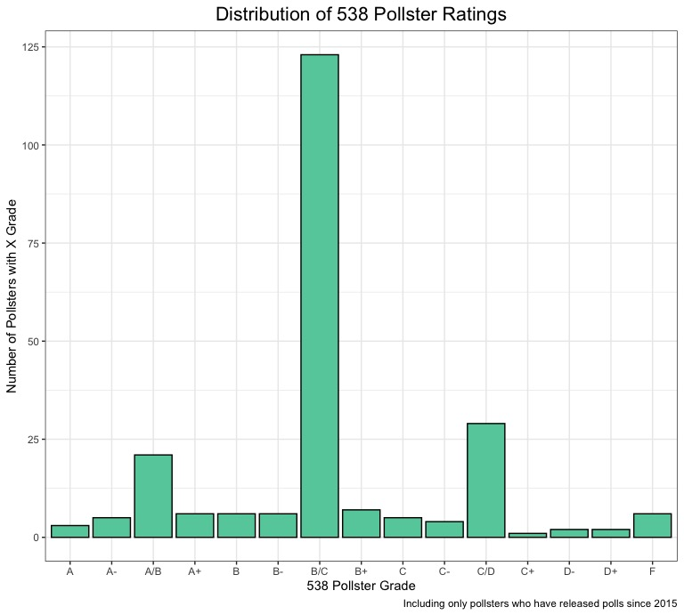
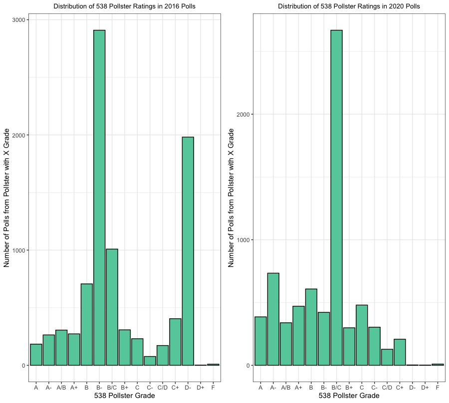
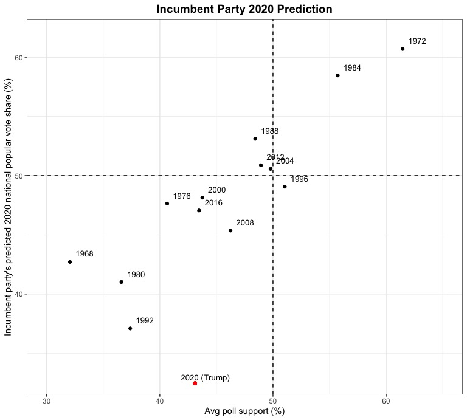
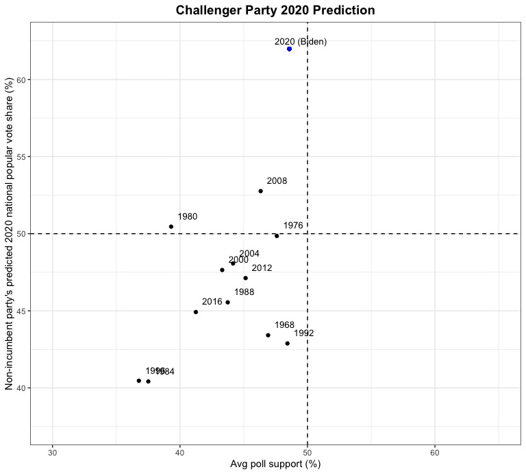

# 09.26 - Modeling the 2020 Election with Polling Data
## Introduction
Last week, investigation into several economic predictor variables illuminated that there is a great deal of variation in the ability of such indicators to predict the outcomes of presidential elections. This week, I'm going to be building off of my work last week by beginning to include polling data in my models. First, I'll be exploring the quality of pollsters and polls from 2016 and 2020 and presenting my findings visually. Then, I'll create several simple ensemble models that combine linear regressions using the economic indicator of Q2 GDP growth to predict popular vote (PV) share with aggregated polling data from 2016, and I'll  use the "best" of these models to make a 2020 election prediction. **Ultimately, I find that my models do a fairly good job of predicting the 2016 election using leave-one-out validation, especially when aggregated polling data is weighted based on pollster quality. However, when it comes to predicting the 2020 election, it seems as though the relatively unprecedented economic conditions that exist as a result of COVID-19 may have skewed my predictions in an unrealistic way.** 

# What does pollster quality look like?
This week, we discussed the range of quality in professional surveys/polls that result from a number of substantive characteristics (survey mode, sample size, historical error). Data journalism outlet [FiveThirtyEight assigns "grades"](https://projects.fivethirtyeight.com/pollster-ratings/) to all major polling firms based on these characteristics. To start, let's take a look at the overall distribution of pollster firm grades:

Here, we can see some interesting trends. A majority of pollsters have a B/C rating, which makes sense. It's probably rare for a large number professional polling firms to recieve horrible grades (if many professional firms are getting "F"s, that would proabably have very dire implications for the state of polling in the United States), but it also seems like very few polling firms are going to be consistently accurate across elections, especially if they are a well-established pollster who has been polling for a number of years or decades. There are also spikes around the "A/B" and "C/D" grades, which makes sense, as the distribution is even on both sides of the center (it could almost be a normal distribution if the data was further aggregated). However, for the purposes of modeling, we care much more about the quality of the polls being produced than the quality of the pollsters generally. Let's take a look at the pollster ratings from polls conducted during the 2016 and 2020 elections:

These plots are really interesting, because you can easily see how the distributions are a little different (in a way that is pretty intuitive given what we know about the context of polling error and the 2016 election, where failure to weight by education led some polls to incorrectly predict Clinton victories in key swing states). In the 2016 distribution, the grades are more concentrated at the lower end of the rating spectrum, with major spikes at "B-" and "D-", while in the 2020 distribution, there is a large spike at "B/C" and a heavier concentration of "A/A-/A+" ratings. Thus, there is definitely variation within poll quality between 2016 and 2020, but I will be able to control for this more by weighting these aggregated polls based on their FiveThirtyEight grades. 

# Model 1 - Average Polling + Q2 GDP
Investigation into the Q2 GDP model last week found that is is a fairly good indicator variable when it comes to predicting the popular vote share of presidential elections (it has a statistically significant p-value and relatively high R-squared value). To start, I created an ensemble model that combined a linear regression (weighted at .5) predicting popular vote share from Q2 GDP growth and 2016 polling averages (weighted at .5) to predict the popular vote share for both the incumbent and challenger in the 2016 election using leave-one-out validation. This model predicted 45.1% for Clinton and 43.6% for Trump (a 1.5% margin of victory), which was actually only .66 percentage points off from the real margin in 2016. This seems like a pretty good model, but is there a way to make it better?

# Model 2 - Average Polling (3 months to the election) + Q2 GDP
In the [Gelman and King (1993) reading](https://hollis.harvard.edu/primo-explore/fulldisplay?docid=TN_cdi_gale_infotracacademiconefile_A14564056&context=PC&vid=HVD2&search_scope=everything&tab=everything&lang=en_US) from this week, the idea that polls become more accurate as they election nears was introduced. Would selecting a subset of aggregated polling data from a timeframe closer to the election make my model more accurate? To do this, I used the same ensemble model as I did in Model 1, but with a smaller subset of polling data. This time, the 2016 predictions from leave-one-out validation showed Clinton capturing 44.4% of the vote and Trump capturing 43.8% of the vote, representing a closer margin of victory for Clinton (1.1%) in the first model. This is probably because the polls generally tighten as the election becomes more temporally proximate, so this makes sense. However, given that Clinton actually won the popular vote in 2016 (despite losing the electoral college and thus the presidency) by a little over 2 percentage points, would it really be fair to say that this model is "better"? 

# Model 3 - Weighted Polling Averages + Q2 GDP
For my final model, I tried to control for the varying quality in polls by weighting the aggregated polling data part of my model by poll grade. I gave all "A" grades a 0.5 weight, all "B" grades a 0.3 weight, and all grades of "C" or lower at 0.2. After this, I combined the weighted polling data with the Q2 GDP linear regression (weighting them equally) and used this ensemble model to make predictions for 2016 using leave-one-out validation. The model predicted that Clinton would win 45.2% and Trump would win 43.6%, marking the smallest difference in predicted margin of victory minus actual margin of victory (.57). Based on this finding, I would call my third model the "best", as it yielded the most accurate margin of victory of the three models. Based on what I knew about the variation in poll quality, it does make sense that controlling for it made my predictions slightly more accurate. However, the very small magnitude of the improvement might also be an indication that changing my economic predictor or adding more would have a much larger impact on the overall model than making small improvements to the quality of the aggregated polling. 

Here's a final recap of the three models before we move into some 2020 predictions with Model 3:

# 2020 Predictions

  Trump                    |  Biden
:-------------------------:|:-------------------------:
  |  

Do these predictions seem a little off? Model 3 predicts that Biden will win 62% of the vote to Trump's 32.5% of the vote, representing around a 30 percentage point margin of victory. Does this seem likely in November? I doubt it. As you can see from the charts, it would represent a victory unprecedented in modern political history and current polling makes it seem highly unlikely. As an experiment, I plugged in a different economic indicator variable to the model, Q2 growth in real disposable income, (and used the same approach to incorporating polling data) to see if it would yield very different predictions. And it did! Using this fourth model, Biden was predicted to win **only 37.5% of the vote to Trump's 64%**. This makes very little intuitive sense, but we are living in strange economic times (where GDP growth has recently hit historic lows while other economic indicators such as the stock market and growth in real disposable income don't necessarily seem to represent the negative economic impact of the COVID-19 induced recession nearly as much). However, this seems to underscore the importance of carefully selecting the predictive variables for your model & evaluating model performance relative to underlying statistical assumptions. I have a pretty good feeling that this model might work well in a "normal" election year, but given the unprecedented circumstances, is there even such a thing as a "normal" election year anymore?

