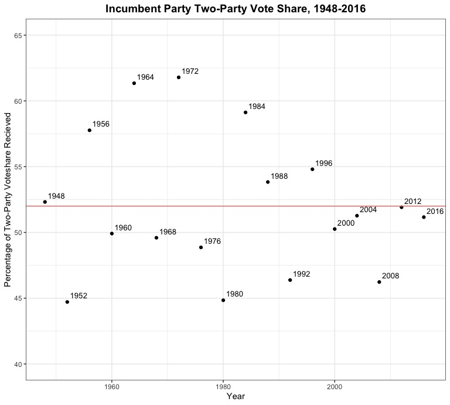
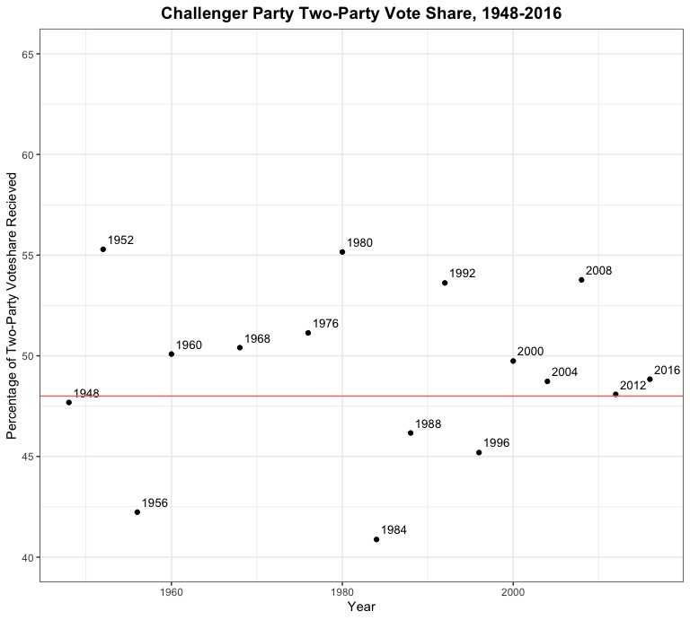
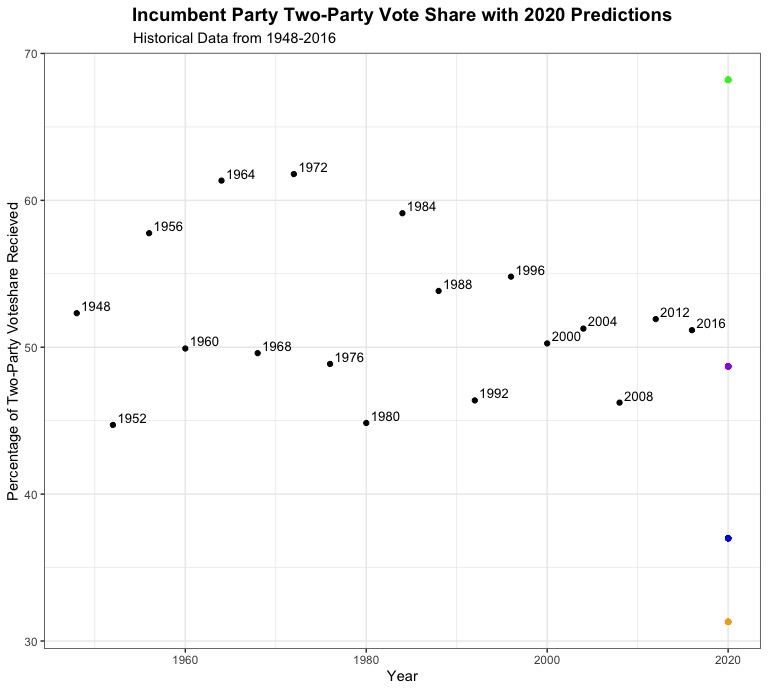

# 10.03 - Exploring Incumbency and the "Time for Change" Model
## Introduction
Last week, I built a weighted ensemble model that used polling averages weighted by pollster quality and the economic indicator of Q2 GDP growth to predict incumbent/challenger popular vote shares for the 2020 presidential election. Through this exploration, I discovered that, while my model was fairly accurate in terms of predicting the 2016 election vote shares using "leave-one-out" validation, it predicted Biden winning the popular vote with nearly a 30 point margin of victory (which seems quite unrealistic in the context of modern presidential election results). This week, I test my "best" model from last week against several variations of the ["Time for Change" model developed by Alan Abramowitz](https://pollyvote.com/en/components/models/retrospective/fundamentals-plus-models/time-for-change-model/). **I ultimately found that the "Time for Change" models I built are more statistically robust than the model that only used polling data and Q2 GDP growth, although the nature of the COVID-19 pandemic led the "Time for Change" model that eschewed an economic indicator to make what seems to be the most feasible prediction.**

## Why "Time for Change?"
The "Time for Change" model, developed by political scientist Alan Abramowitz, is fundamentally [premised on the idea that an election is a referendum on the incumbent president's party](http://www.emory.edu/news/Releases/time-for-change.html). The model uses three factors to ultimately predict the vote share of a candidate: Q2 GDP growth (one of the key predictive variables in my [blog post from last week](https://parkermas.github.io/gov1347-blog/09-26)), net presidential approval rating at the end of June, and whether or not the candidate is an incumbent. Historically, this model has been incredibly successful, and [was optimistic about Trump's chances to take the presidency in 2016](https://www.nytimes.com/2016/05/11/upshot/voters-fears-about-trump-may-outweigh-wish-for-change.html), when pundits overwhelmingly thought that Hillary Clinton was going to win the election. 

## What's the big deal with incumbency?
In the past 10 presidential elections that included incumbent candidates, [seven of them were won by the incumbents](https://www.npr.org/sections/itsallpolitics/2012/06/11/154745966/why-its-good-to-be-the-incumbent). Looking at the two-party popular vote shares for the incumbent party's candidate and the challenging party's candidate (see scatter plots below, with the average vote share represented by a red horizontal line), incumbents recieve, on average, around four percentage points more of the popular vote than challengers do. This makes intuitive sense: sitting presidents have name recognition, control over a significant amount of the federal government, the symbolism of the office, and established fundraising and campaigning advantages that ultimately seem to translate into a small advantage come election season. 

  Incumbent                    |  Challenger
:-------------------------:|:-------------------------:
  |  

# Models
To investigate the efficacy of the "Time for Change" model, I created a few variations of the model to compare to my "best" model from last week. As a reminder, my model from last week was a weighted ensemble model that combined polling averages (weighted by [FiveThirtyEight pollster grade](https://projects.fivethirtyeight.com/pollster-ratings/)) and a linear regression that predicted popular vote share from Q2 GDP growth to ultimately predict the two-party vote share for Trump and Biden in 2020. The regression used in the model had an R-squared value of 0.28 and a mean squared error of 17.7, and predicted that Biden would win with 63% of the vote to Trump's 37%. Ultimately, it seemed that this was an unrealistic prediction, in large part due to the fact that the United States saw record low Q2 GDP growth this year due to the COVID-19 pandemic. But do the "Time for Change" models fare any better? Take a look at the scatter plot below to see the variation in my four predictions, represented by four differently colored dots. Without knowing anything about the statistical soundness of the quality of the models, which of these looks like the best prediction? 

## Model 1
Now, let's get into the details of these models. My first "Time for Change" model is basically Abramowitz's original model, which uses Q2 GDP growth, net presidential approval rating, and incumbency status to predict the two-party vote share for the incumbent candidate. In terms of statistical descriptors, this model ended up having an R-squared value of 0.62 and a mean squared error of 8.3 (respectively, the highest and lowest values of any of the models I created). Compared to the previous week's model, it already seems like this model is an improvement (having better predictive capabilities and less error). However, it predicts that Biden will win the two-party popular vote share with an even larger margin, beating Trump 68.7% to 31.3%. Interestingly enough, this model predicts that Biden will do even better once incumbency (which we usually think of as an advantage for the presidency and a disadvantage for a challenger like Biden) and net approval rating are included as variables in a model. However, given that Trump had a net -19 approval rating at the end of June and that the US saw historically negative GDP growth in Q2, it's not all that surprising that the model predicts a Biden landslide. Still, it doesn't seem very realistic.

## Model 2
My second model for this week, a slight variation on the first "Time for Change" model, uses Q2 growth in real disposable income as a predictive variable instead of Q2 GDP growth. This model is not incredibly different from the first model in terms of statistical quality, with a slightly lower R-squared value of 0.53 and a slightly higher mean squared error value of 9.5. However, its predictions for 2020 are wildly different, predicting a Trump win with 68.2% of the vote to Biden's 31.8%. This also seems unrealistic, but it also makes sense. [Real disposable income soared during Q2 2020](https://www.cnbc.com/2020/07/30/us-gdp-q2-2020-first-reading.html) as a result of direct cash transfers to Americans that were included as part of an initial COVID-19 stimulus package, and this is reflected as a huge advantage for Trump in the model (even if it doesn't really paint a completely accurate picture of "the economy"). Perhaps including any kind of economic indicator from Q2 of this year is going to produce very skewed predictions no matter which indicator is chosen?

## Model 3
For my final model, I decided to leave out the economic predictor variable entirely, and see how approval rating and incumbency do as the sole predictive variables in a stripped-down "Time for Change" model. The results are incredibly interesting. This model has an R-squared value of 0.53, identical to the previous model, and has a higher mean squared error too (10.3). However, this model's prediction seems to be much more plausible. It predicts a Biden win, with Biden recieving 51.3% of the two-party popular vote share to Trump's 48.7%. This makes intuitive sense, as it is only looking at two variables, one of which (incumbency) presents a clear advantage for Trump while the other (net presidential approval rating, which is -19 for Trump) presents a clear advantage for Biden. Still, from a statistical perspective, this model is less "accurate" than the first "Time for Change" model I created, which likely speaks to the importance of including some sort of predictive variable that captures the economic "fundamentals" going into an election year. The question is, what economic fundamentals (if any?) will accurately represent the state of the US economy [during a historically unequal and unprecedented pandemic-induced recession](https://www.washingtonpost.com)?

 
