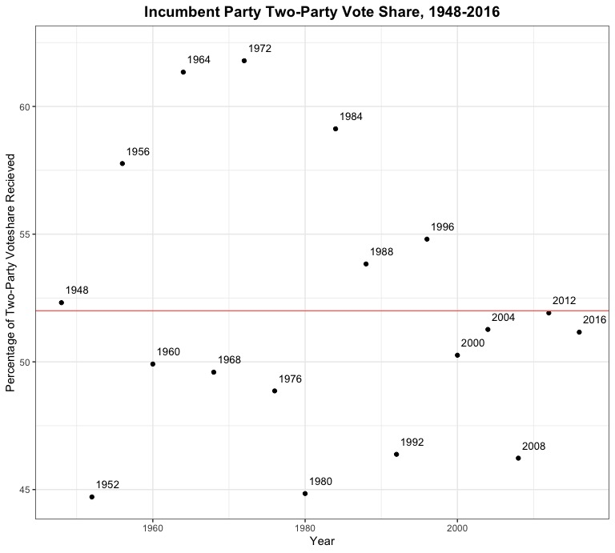
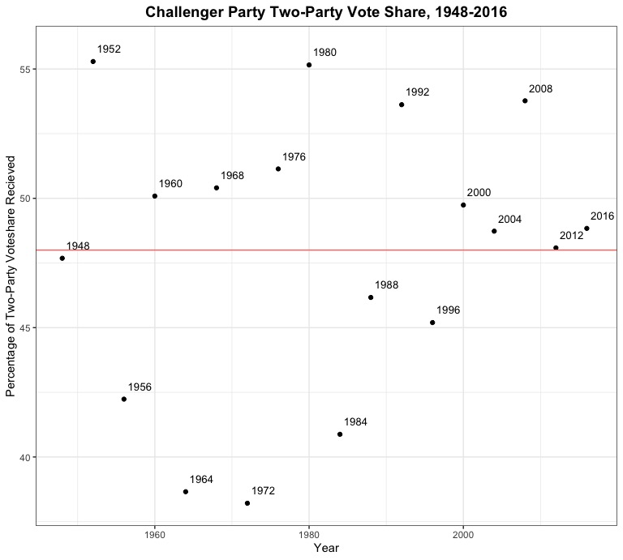

# 10.03 - Exploring Incumbency and the "Time for Change" Model
## Introduction
Last week, I build a weighted ensemble model that used polling averages weighted by pollster quality and the economic indicator of Q2 GDP growth to predict incumbent/challenger vote shares for the 2020 presidential election. Through this exploration, I discovered that, while my model was pretty good in terms of predicting the 2016 election vote shares using "leave-one-out" validation, it predicted Biden winning the popular vote with nearly a 30 point margin of victory (which seems quite unrealistic in the context of modern presidential election results). This week, I test my "best" model from last week against several variations of the ["Time for Change" model developed by Alan Abramowitz](https://pollyvote.com/en/components/models/retrospective/fundamentals-plus-models/time-for-change-model/). **I ultimately found that the "Time for Change" models I built are more statistically robust than the model that only used polling data and Q2 GDP growth, although the nature of the COVID-19 pandemic led the "Time for Change" model that eschewed an economic indicator to make what seems to be the most feasible prediction.**

## Why "Time for Change?"
The "Time for Change" model, developed by political scientist Alan Abramowitz, is fundamentally [premised in the idea that an election is a referendum on the incumbent president's party](http://www.emory.edu/news/Releases/time-for-change.html) The model uses three factors to ultimately predict the vote share of an candidate: quarter 2 GDP growth (one of the key predictive variables in my [blog post from last week](https://parkermas.github.io/gov1347-blog/09-26)), net presidential approval rating, and whether or not the candidate is an incumbent. Historically, this model has been incredibly successful - it's [correctly predicted the outcome of every election since 1992](https://pollyvote.com/en/components/models/retrospective/fundamentals-plus-models/time-for-change-model/) and [was bullish about Trump's chances to take the presidency in 2016](https://www.nytimes.com/2016/05/11/upshot/voters-fears-about-trump-may-outweigh-wish-for-change.html), when pundits overwhelmingly thought that Hillary Clinton was going to win the election. 

## What's the big deal with incumbency?
In the past 10 presidential elections that included incumbent candidates, [seven of them were won by the incumbents](https://www.npr.org/sections/itsallpolitics/2012/06/11/154745966/why-its-good-to-be-the-incumbent). Looking at the two-party popular vote shares for the incumbent party's candidate and the challenging party's candidate (see scatter plots below), incumbents recieve, on average, around four percentage points more of the popular vote than challengers do. This makes intuitive sense: sitting presidents have name recognition, control over a significant amount of the federal government, the symbolism of the office, and established fundraising and campaigning advantages that ultimately seem to translate into a small advantage come election season. 

                            |  
:-------------------------:|:-------------------------:
  |  
