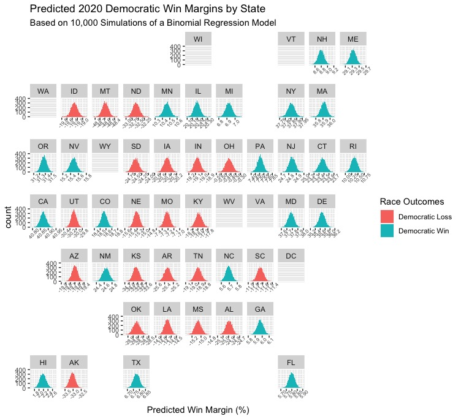
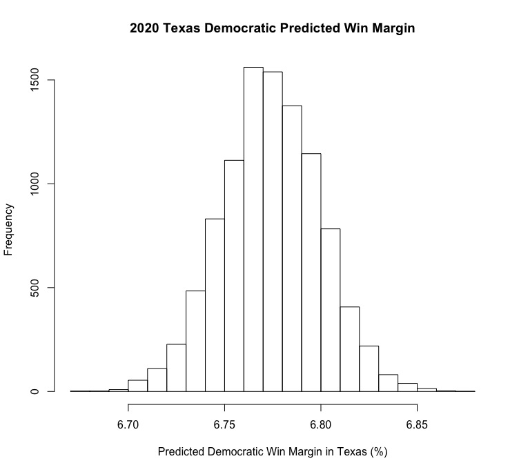
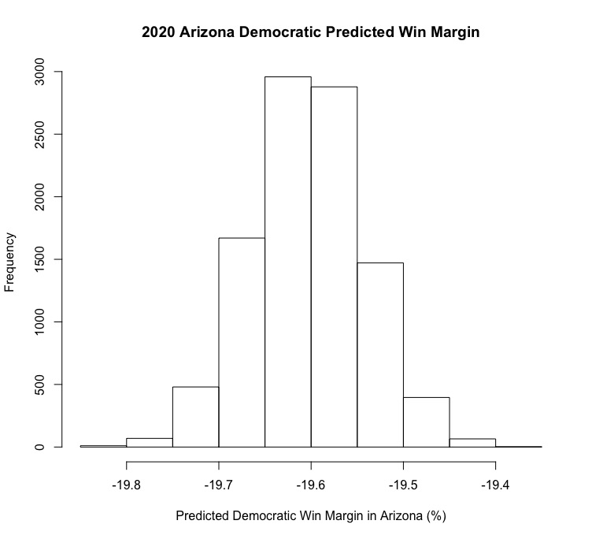
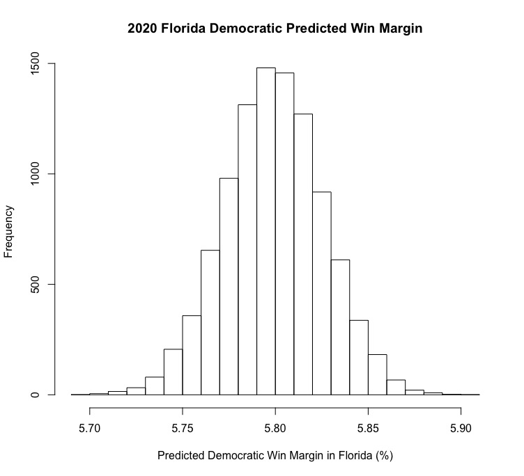

# 10.10 - Probabilistic Models & Presidential Election 2020
## Introduction
Over the past few weeks, I've built models that use data and statistical methods such as linear regression to predict the outcomes of elections. However, one weakness of these models is that they present predicted outcomes as fixed points rather than presenting the probability of certain outcomes occurring. This week, I'll be using binomial logistic regression (which allows the setting of upper and lower bounds on possible predictions) and 10,000 simulations of the process to try to predict the range of possible values of the statewide vote totals for both candidates in the 2020 election. Because each state's election outcome for either Democrats or Republicans can essentially be thought of as some draw of voters from the total voter-eligible population turning out to vote Democratic or Republican, respectively, we can predict the range of likely outcomes for each state in order to both provide estimates for a given candidate's win margin and the likelihood that each outcome will occur. 

What data is actually informing these models? I will be using historical state presidential election popular vote totals, the most recent data on the population of residents in each state who are eligible to vote, and current polling averages for 2020 to create binomial logistic regressions that can be used predict the chances of a candidate winning a certain amount of voters in each state. From there, I will run 10,000 simulations that represent draws from a repeated binomial process for the entire population of eligible voters, representing the distribution of expected possible outcomes for the election in the state.

## Results
Below is a geofacet plot that shows the distribution of predictions for each state in the United States (note that there were some errors/inconsistencies in the data that caused several states to not yield predictions). States where this model predicts Biden to win are in Blue, and states that the model predicts Biden will lose (and thus Trump will win) are in Red.

Most results in this plot aren't extremely surprising. For example, in a deep blue state like Massachusetts that Hillary Clinton won by [over 27 points in 2016](https://www.nytimes.com/elections/2016/results/massachusetts-president-clinton-trump), the model predicts a Biden win margin of 35-36 points. Similarly, in a deep red state like Idaho, Trump is predicted to win by nearly 20 points. and this makes sense given his [nearly 30-point victory](https://www.nytimes.com/elections/2016/results/idaho) over Clinton there in 2016. However, some results are a little surprising, and would represent dramatic shifts in the electoral map. Below, I'll explore some of these somewhat counterintuitive results and see if any of them make sense upon closer examination.

### Texas

If you've been following coverage of the 2020 election (or American politics generally for the last decade or so), you've probably heard [plenty of pundits & analysts ask a question](https://www.fox10phoenix.com/news/2020-election-texas-hasnt-voted-democrat-since-1976-but-the-state-is-in-play-this-year-experts-say) with an answer that has massive implications for electoral politics: when will Texas go blue? My model's answer? 2020. The predictions are distributed around a median value of around 6.75 (indicating a Biden win margin of almost 7 points), which would be an enormous upset for Biden. Does it seem likely? Not entirely. The current [FiveThirtyEight polling average](https://projects.fivethirtyeight.com/polls/president-general/texas/) puts Trump at a small lead of less than 2 points in the state, which is certainly a small enough margin for Biden to overcome on election night. This, combined with the trend of Texas voting more "blue" in modern electoral history (Trump won the state [by less than 10 points in 2016](https://www.nytimes.com/elections/2016/results/texas) while McCain easily won Texas [with a nearly 12-point lead in 2008](https://en.wikipedia.org/wiki/2008_United_States_presidential_election_in_Texas)) are the most likely reasons why the model seems to be so optimistic for Biden. Ultimately, it seems very probable he could win, but a 7 point victory there would surely spell an election night wipeout for Trump. 

### Arizona

Personally, this was the most shocking result from the entire geofacet plot. Arizona, which, despite only voting for a Democratic presidential candidate once since 1952, has been [trending heavily blue in recent electoral history](https://www.nytimes.com/2020/09/25/us/politics/arizona-biden-trump-kelly-mcsally.html) after electing a Democrat to the Senate in 2018. Polling shows Biden [maintaining a steady lead in the state](https://www.nytimes.com/2020/10/05/us/elections/politics-arizona-poll.html), and Democratic Senate candidate Mark Kelly is expected to beat Republican incumbent Martha McSally in the state's high-profile Senate race this year. So why does the model have Biden losing by nearly 20 points? My guess is that the state's history of heavily favoring Republicans has a lot to do with it. As we saw with Texas, trends in a state's electoral history seem to weigh heavily in this model, and the relatively quick shift in Arizona's partisanship is not accurately reflected as a result.

### Florida

Will Florida decide the 2020 election? If you're Biden, and you're looking at my model, you probably hope so. Florida, which is the U.S.'s largest swing state and has [the lowest average margin of victory for presidential candidates](https://www.heraldtribune.com/in-depth/news/2020/10/12/donald-trump-and-joe-biden-tied-florida-americas-largest-swing-state-and-key-battleground/5802371002/) of any state (2.6%), could very well decide the election. My model thinks that Biden will win the election by nearly 6 points, which, in the context of the average margin of victory for presidential candidates in the state, seems highly unlikely. I'm honestly not sure what really explains this fairly large predicted lead for Biden - the state has had [extremely close margins of victory for presidential candidate winners in the last 5 elections](https://www.270towin.com/states/Florida) (with the largest margin being 5%), and Republicans have won the state in 3 of those elections to Democrats 2 victories (that is to say, there are no overwhelming historical trends that would explain this victory). Perhaps Biden's nearly 5 point lead in the [Florida FiveThirtyEight polling averages](https://projects.fivethirtyeight.com/polls/president-general/florida/) helps explain some of this, but his predicted margin of victory is even larger, which is puzzling. 

## Conclusion
Ultimately, the binomial logistic regression-based models that I created this week allowed me to make predictions about 2020 state presidential election results and speak to the probability of those outcomes occurring. While most states' predictions were fairly straightforward, some surprising swing state predictions allowed me to think more deeply about the logic that powers the model and some of its shortcomings. Ideally, I will be able to incorporate a broader variety of data (e.g., data on advertising and campaign spending, economic fundamentals, characteristics like incumbency that speak to the context of an election) to make more fully developed predictions of this nature going forward.

