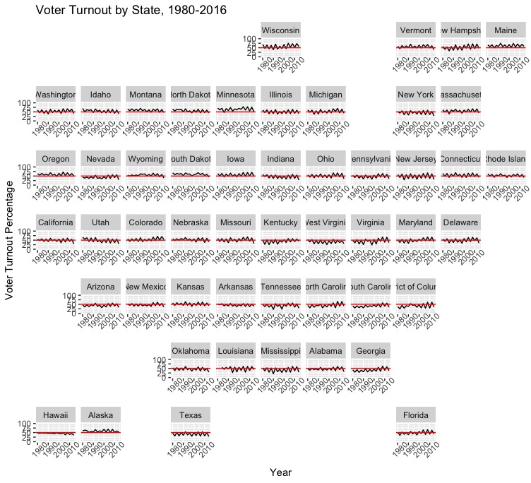
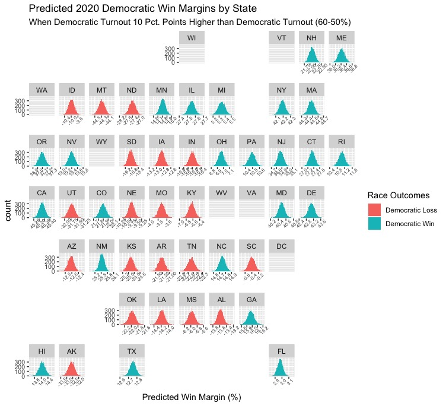
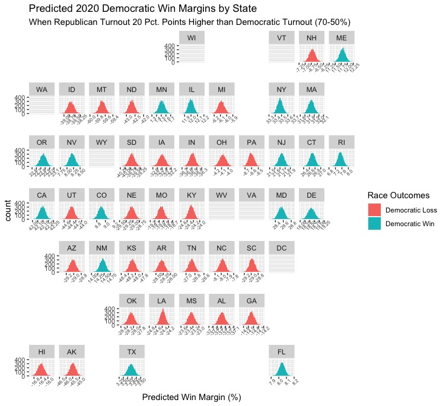

# Introduction
Last week, I built probabilistic models that used binomial logistic regression to predict a distribution of statewide election results based off of historical results and random draws that represent possible rates of voter turnout. However, one flaw of this model is that it ultimately used only one value to represent the turnout rate of the voting eligible population (VEP), while the actual range of possibilities for the turnout rate (nationally or for any given state) could be represented by a range of possible values bounded by a maximum and minimum informed by historical data and recent trends. Thus, I decided to explore historical trends in presidential election turnout by state and expanded upon my models from last week to more accurately reflect expected 2020 turnout rates for the presidential election. 

Above, see a geofaceted plot that shows the historical state turnout rates for all federal elections from 1980-2016. The 50% mark is highlighted by a red line, and as you can see, most states consistently have a voter turnout that is somewhere around 50%. Some states, like Minnesota, tend to have higher than average voter turnout, and other states, such as Tennessee, tend to have lower than average voter turnout. While it is impossible to predict the exact turnout rate for the upcoming 2020 election, we can pretty confidently say that the voter turnout rate won't be 30% or 80%. If anything, it would make the most sense if it was between 50 - 60%, as the 2016 presidential election [saw a turnout rate of 55.5%](https://en.wikipedia.org/wiki/Voter_turnout_in_the_United_States_presidential_elections) and the 2018 midterm elections saw a [record-breaking turnout of 49.3%](https://www.vox.com/policy-and-politics/2018/11/19/18103110/2018-midterm-elections-turnout) (Which was the highest turnout for a midterm election in the past century). Over the course of presidential elections from the past 50 years, the lowest turnout rate was 49% and the highest was 60.7%. 

## National Model
Based on analysis of historical trends in voter turnout, I updated my probabilistic models from last week in order to set boundaries for possible Republican and Democratic turnout so that my predictions will more accurately reflect the likely reality of the 2020 election. I created two national models (both with minimum turnout set at 0.45, which would represent very low turnouts in modern history) that give turnout advantages to Democrats and Republicans in order to see how these advantages would affect state outcomes. Based on my research, it seems that there is not comprehensive data on voter turnout by party, so for the first model, I set maximum Democratic turnout to 0.6 and maximum Republican turnout to 0.5. This would reflect an election where Democrats are particularly energized, while Republicans are around the same or slightly less likely to vote than they were in 2016. For the second model, I set maximum Democratic turnout to 0.5 and maximum Republican turnout to 0.7, which would reflect a night where Democrats were as unenthusiastic or more unenthusiastic than 2016 and where Republicans have record-breaking turnout (I don't necessarily think that such a high Republican turnout, especially relative to Democratic turnout, is realistic, but this gap helped better illustrate the advantage that the Republicans would need to successfully compete for the electoral college). 

  Democratic Advantage                    |  Republican Advantage
:-------------------------:|:-------------------------:
  |  

These models are pretty interesting. The first model predicts that the Democratic turnout advantage, while smaller than that of the advantage given to Republican turnout in the other model, will have a massive impact on the winner of the electoral college. Not only would Democrats win back states they lost to Republicans in 2016 (Michigan, Pennsylvania, Florida), but they would also win historically red states like Georgia and Texas. For the Republican turnout advantage model, the predictions do not paint quite as optimistic of an outlook for the party in question. Even though Republicans would hold states that went red in 2016 with a 20 point turnout advantage, my model predicts that some states would still flip blue, such as Texas. Still, the model predicts that Republicans would be able to flip some unexpected states (Hawaii, New Hampshire). 
