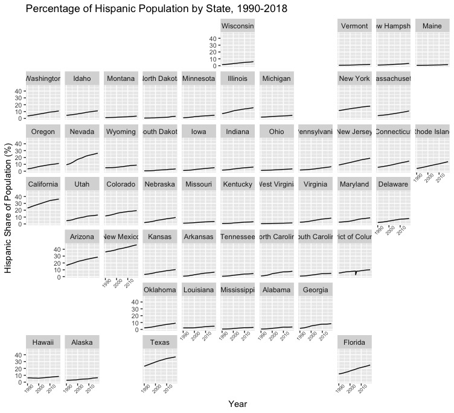
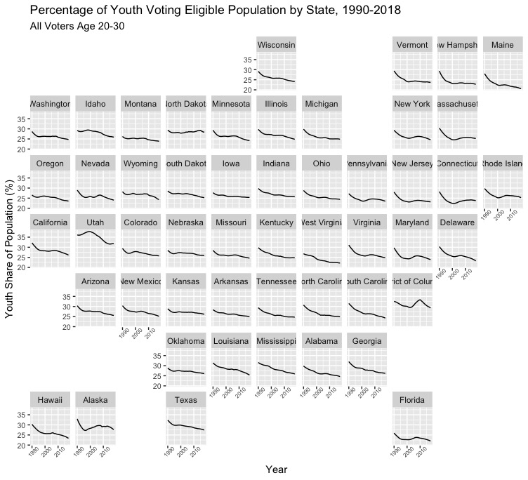
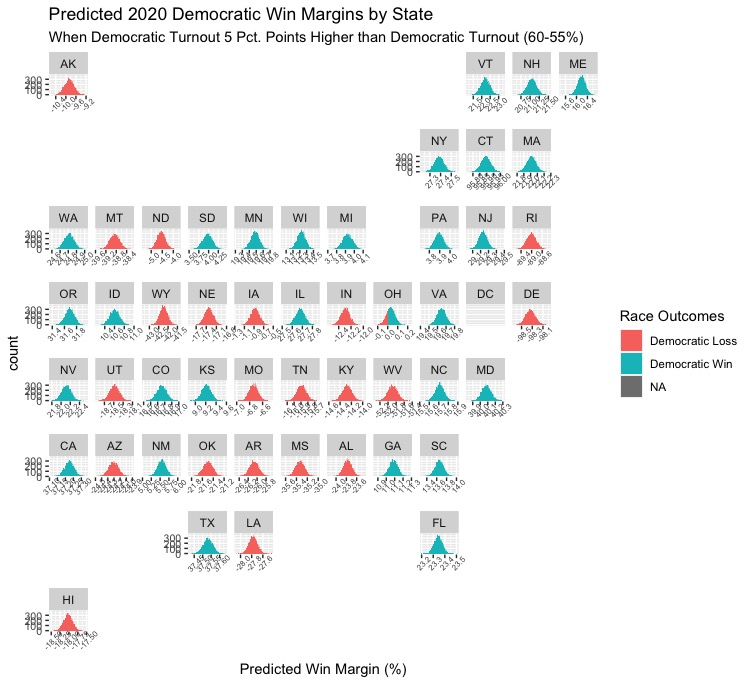
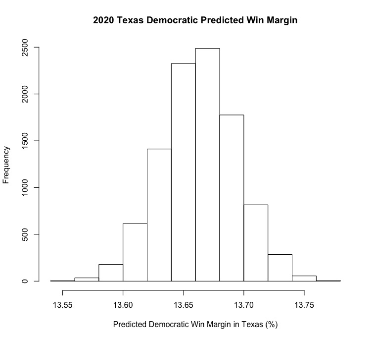
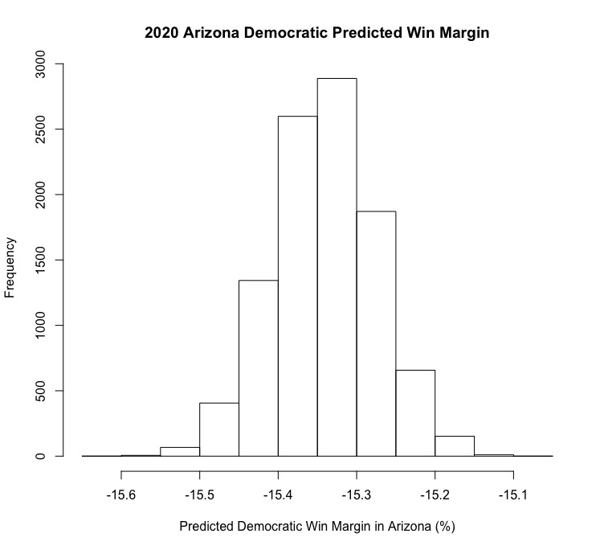

# Introduction

Last week, I continued to build on my probabilistic models by incorporating possible variance in turnout into both national and statewide models. However, one of the weaknesses of my models is that they essentially only used historical and current polling averages to predict the outcome of the 2020 election without incorporating other relevant indicators such as economic or demographic data. As a result, I subsequently focused on building on these models this week by including data on demographic change based on the theory that certain groups are likely to vote for certain political parties and thus changes in these groups will be reflected in the outcome of the election. Specifically, given a wide range of reporting on the [growth of the Hispanic/Latino voting population in the US](https://time.com/5674850/2020-election-demographics/) and potential [record-breaking youth turnout](https://www.teenvogue.com/story/early-youth-voter-turnout-2020-election-data), it seems like changes in these two groups as a share of the total voting-elegible population (VEP) will be the most relevant for predicting the 2020 election. Ultimately, my model predicts a Biden win and shows more positive win margins for Biden in certain swing states with high proportions of Hispanic voters as part of their VEPs, such as Texas and Arizona.

# Historical Trends 

First, let's take a look at trends in the share of Hispanic voters as part of the VEP in each state. As you can see, the share of Hispanic voters has generally increased in all states over time, with some states in the South and Southwest seeing fairly large shifts in the past decade or two. In 2020, many states such as Texas, Nevada, and Arizona will all have more Hispanic voters than in any previous election in history. Historically, [Hispanic and Latino voters have tended to vote for Democrats](https://www.opendemocracy.net/en/democraciaabierta/us-election-latinos-lean-democratic-but-biden-cant-take-their-vote-for-granted/), so many experts suggest that the growth of the demographic group will make previously Republican strongholds such as Texas competitive for Democrats. 

Next, let's take a look at trends in the share of young people as part of the VEP in each state. Interestingly enough, the share of young people in most states declined during the 1990s, generally rose slightly during the mid-2000s, and saw another small decline during the first half of the 2010s. Because the most recent demographic data available was from 2018, it's very likely that the percentage of young people as part of the VEP in most states has increased since then, but it is interesting to see that there has been a net decrease in young people as part of the VEP over the past two decades. 

# Models
Below, take a look at the results of the model I created to predict the outcome of the 2020 election in every state. Like with last week, I set the minimum turnout to 0.45, as there have been virtually no elections in modern history with lower turnout. However, while I had set maximum Democratic turnout to 0.6 and maximum Republican turnout to 0.5 last week, I decided to adjust maximum Republican turnout to 0.55 after reading about how Republicans are [catching up in terms of early voting in key battleground states](https://www.politico.com/news/2020/10/24/republicans-florida-early-vote-democrats-432135). Some of the most interesting takeaways include the increase in Biden's margins of victory in states that are heavily Hispanic, such as Texas, Florida, and Nevada, which makes sense given the theory regarding demographic change as outlined earlier. Some strange results were also worth noting as well -- for whatever reason, my model thinks that Republicans will win Rhode Island and Delaware by huge margins. 

# States
  Texas          |  Arizona
:-------------------------:|:-------------------------:
  |  

It's also worth examining how a model that uses polling averages and the change in the Hispanic and youth VEP plays out in individual states such as Texas or Arizona. I decided to keep the minimum and maximum bounds on Democratic turnout the exact same as I did last week, with the only changes being the inclusion of demographic indicators in the model and the updating of the 2020 polling averages that had been used in the previous model. Ultimately, in both states my models predicted that Biden would have a greater win margin (Texas) or a smaller lose margin (Arizona) than the previous models did, and this is likely due to the inclusion of relevant data on demographic change that is predicted to affect the election in these states particularly. It will be interesting to see if these trends materialize in a win for Biden in the next week and a half, or if the Hispanic vote breaks less favorably for Biden/the youth vote fails to materialize as election day grows closer.
