# Introduction

Over the course of the past few weeks, I've explored several different ways to model elections, with a focus on predicting the outcome of the upcoming 2020 presidential election. In this post, I'll be making my final prediction before the election and discussing the choices I made when building my model. To make my prediction, I chose to use a two-sided ensemble model that predicts a seperate vote share for the Democratic and Republican candidates, respectively. I considered both a pooled and an unpooled variation of the model, but ultimately decided to use the unpooled model to make my final prediction. Ultimately, my model predicts a somewhat narrow electoral college victory for Biden, with the candidate predicted to flip key battleground states in the midwest (Michigan, Pennsylvania, Wisconsin, etc.) that broke for Trump in 2016 while falling short in several other swing states where the most recent polling has pointed to potential victories (Florida, Texas, Georgia, North Carolina).

# Model Description

For the forecast, I used multiple linear regression to predict state-by-state vote shares for both the Democratic and Republican candidates as part of a weighted ensemble model. Each state's party vote share prediction is comprised of two equally weighted predictions from two multiple linear regressions, with one using polling data to predict popular vote share ("polls") and the other using lagged vote share, the change in the state's white population, and whether the candidate's party currently has incumbency status ("plus"). Here, the polling averages are fit into their own regression because the r-squared value tends to decrease when other covariates are added into the regression, so I thought it made the most sense to create a separate regression that could be fit with other predictive variables. While I initially tested a number of variables for the second regression, including economic variables such as Q2 gross domestic product (GDP) growth and Q2 real disposable income (RDI) growth alongside other demographic variables, such as the change in the 65+ population or the change in the Black population of a state, I ultimately found that my second regression generally yielded the highest r-squared values when it was fit with only the three variables I selected. Below, see what these regressions look like when written out as formulas:

y1
​	 =β 
0
​	 + β 
1 x
​	 lagged_voteshare
​	 + β 
2 x
​	 white_change
​	 + β 
3 x
​	 incumbent_party
​	 + ϵ

y2
​	 = β 
0
​	 + β 
1 x
​	 avg_poll
​	 + ϵ

y_prediction
​	 = (y1 x 0.5)
​	 + (y2 x 0.5)

# Model Validation

When creating my model, I had initially experimented with both unpooled and pooled models in order to see which would be a better option for predicting 2020. With a completely unpooled model, each state's prediction is made using only applicable historical data from that state, meaning that national trends are deemphasized and a certain critical mass of data is needed for each state in order to make a reliable prediction for each state's vote share. Alternatively, a pooled model makes predictions for individual states based more heavily off of national trends and subsequently de-emphasizes state trends that can often be important for predicting particular state outcomes. Take a look at this summary table, which shows several metrics for in and out-of-sample fit for both the pooled and unpooled models I created:

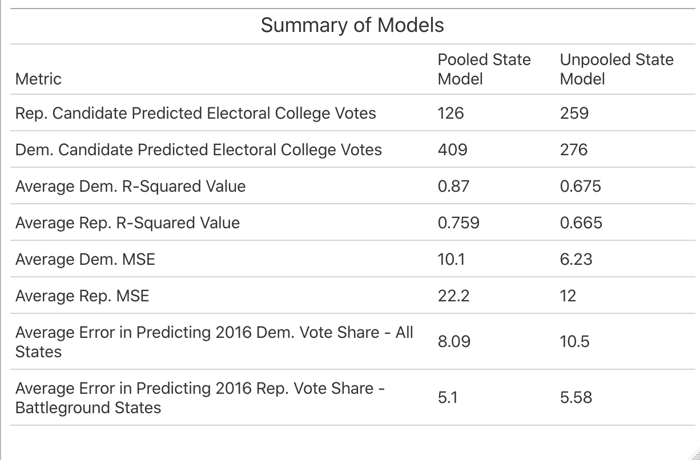

As you can see, both models have fairly high average R-squared values for both the Democratic and Republican sides of the model. The pooled model does have slightly higher average R-squared values overall, indicating that the proportion of the variance in the vote share that can be predicted from the predictive variables is greater than that of the unpooled model. However, the unpooled model ultimately had lower average mean squared error (MSE), meaning that the in-sample predictive performance was better than that of the pooled model. When both models were tested using leave-one-out validation to predict the results of the 2016 election, the pooled model generally performed better overall, but the unpooled model had less error when it came to predicting [battleground states](https://www.nytimes.com/interactive/2020/us/elections/battleground-states.html). Here are how both models predicted the 2016 election:

  Pooled          |  Unpooled
:-------------------------:|:-------------------------:
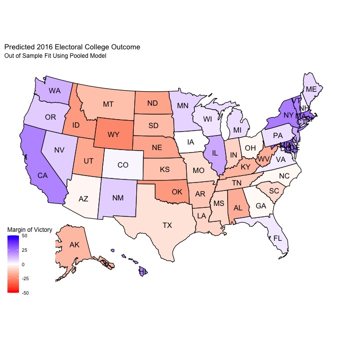  |  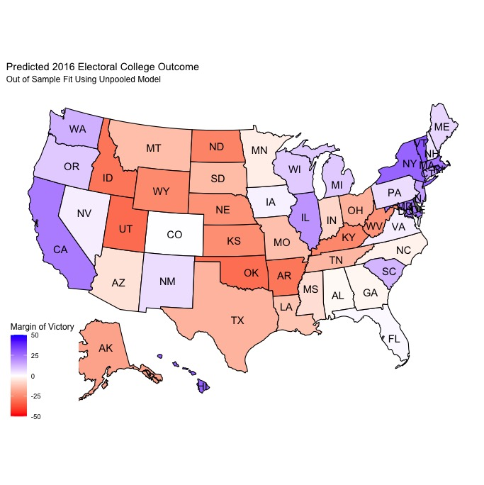

Both are pretty similar in terms of the electoral college predictions, with the pooled model predicting 2016 Democratic/Republican electoral college vote totals of 311/224 and the unpooled model predcting a 307/228 breakdown. These predictions (and the maps) are actually fairly similar to [FiveThirtyEight's predicted electoral college map and vote totals prior to the 2016 election](https://projects.fivethirtyeight.com/2016-election-forecast/). 

Ultimately, disproportionately lower MSE in the unpooled model in addition to its superior prediction power when it came to battleground states made it seem a little more plausible in terms of accurately predicting the 2020 election. These plots show the distribution of average R-squared and MSE values for the Democratic and Republican models across states.

  R-Squared          |  MSE
:-------------------------:|:-------------------------:
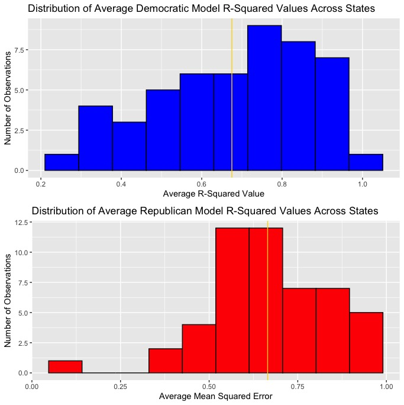  |  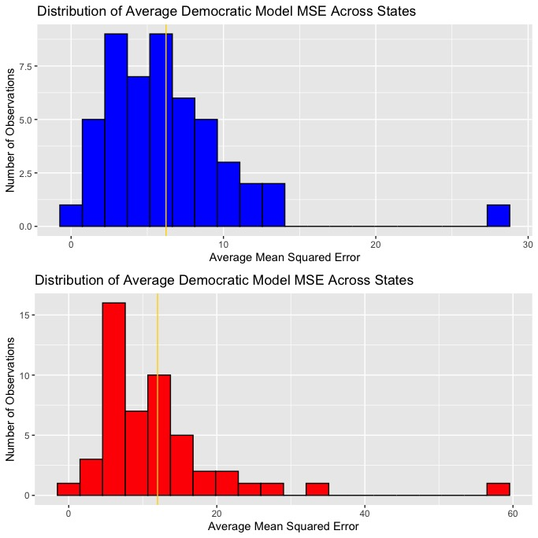

In all the plots, the average R-squared and MSE values are labeled with gold lines. As you can see, the Democratic regressions have both a higher average R-squared value and a lower average MSE, indicating that the Democratic vote share predictions should generally be somewhat more accurate than that of the Republican vote share predictions. 

# Prediction

 My model's prediction for the candidate's electoral college vote totals and the electoral college map is as shown below:
 
   Vote Totals          |  Map
:-------------------------:|:-------------------------:
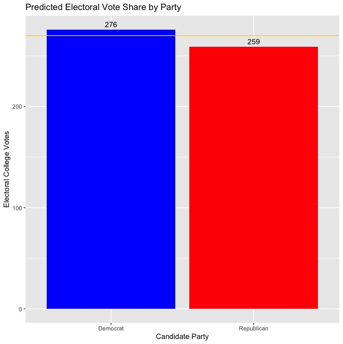  |  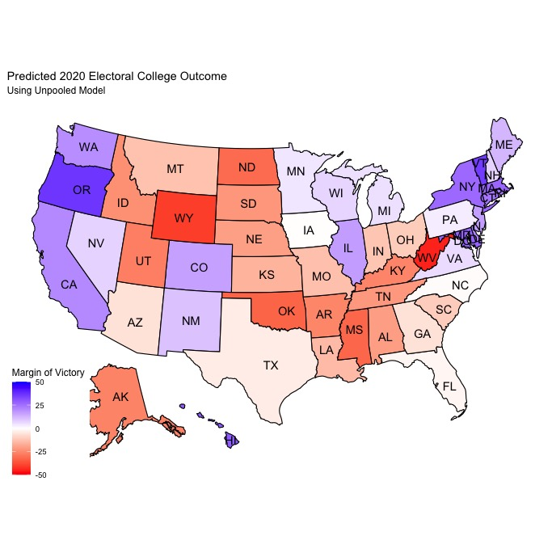

# Uncertainty

In order to visualize uncertainty, I created scatter plots with the points from both regressions (polls & plus) used to model each state's Democratic and Republican vote shares, with vertical bars extending upward and downward to represent the lower and upper bounds of a 95% confidence interval, meaning that if we were to take 100 samples and find the 95% confidence interval for each of them, the real value would be within that range in 95 of the 100 samples. Let's take a look at the confidence intervals from the polls & plus regressions:

## Polls

  Democrat          |  Republican
:-------------------------:|:-------------------------:
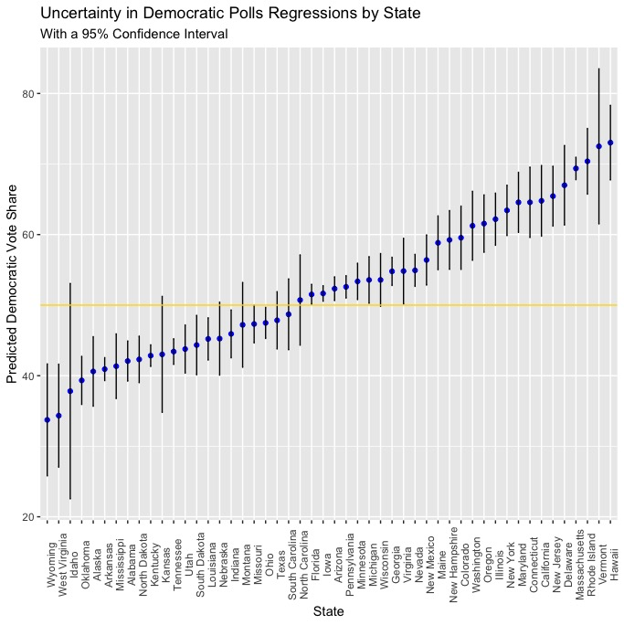  |  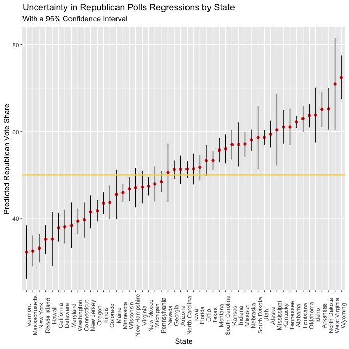

## Plus

 Democrat          |  Republican
:-------------------------:|:-------------------------:
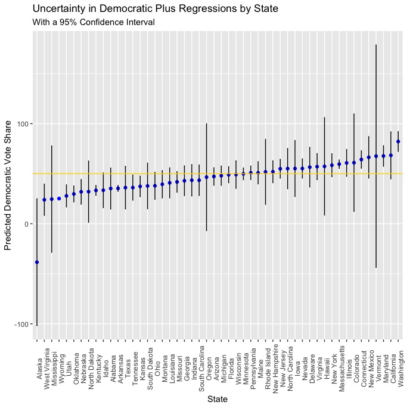  |  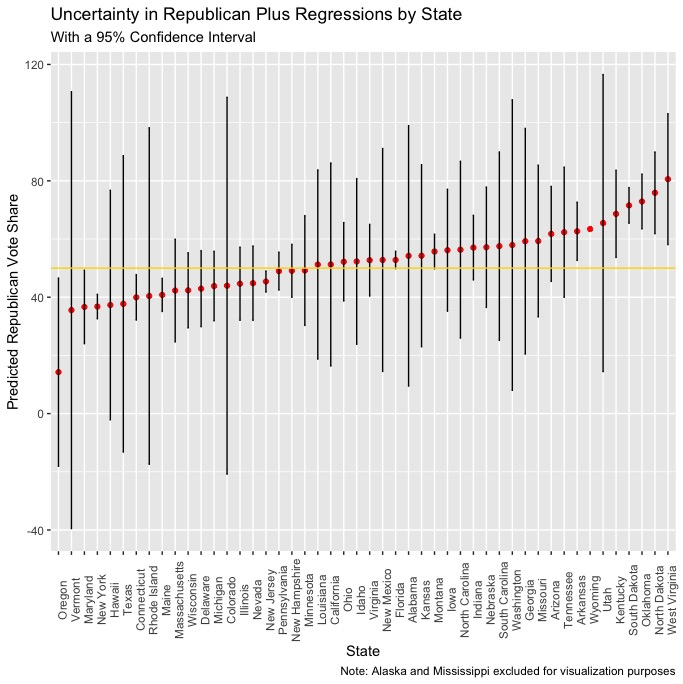

It seems as though 

