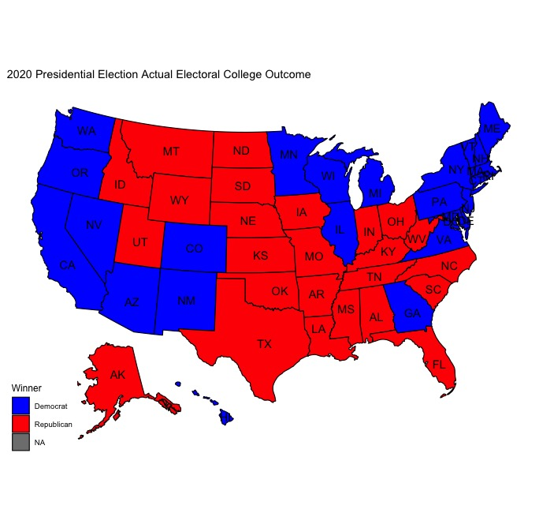
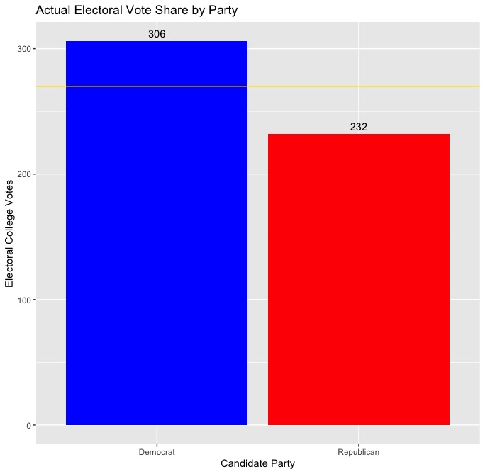
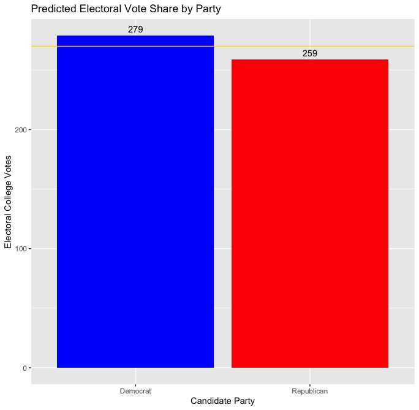
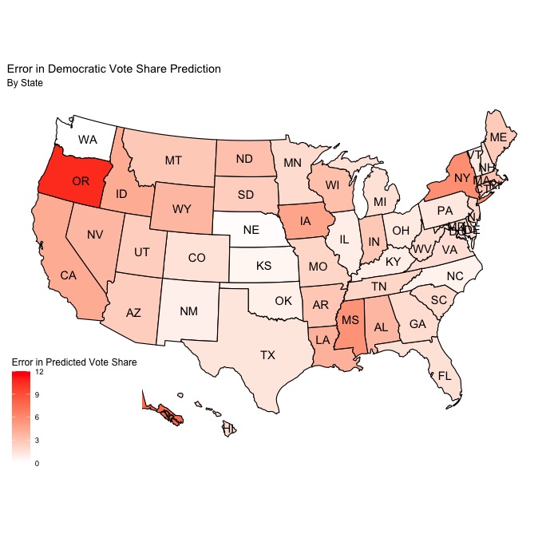
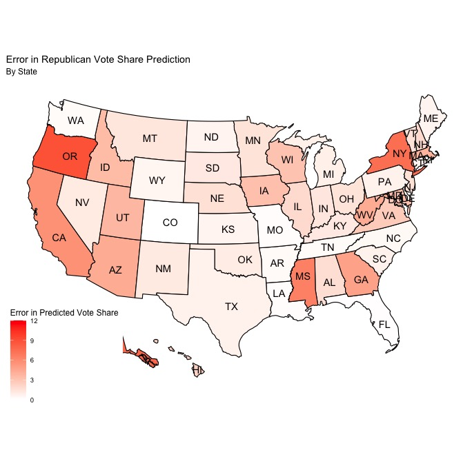
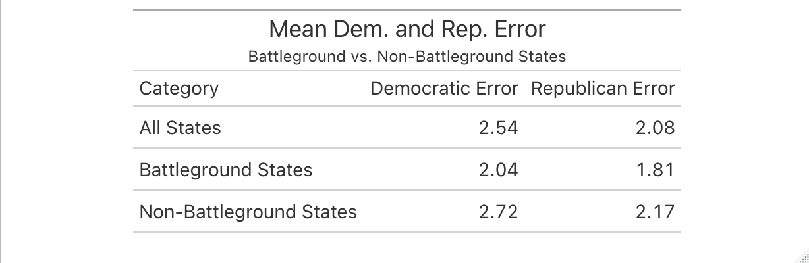

# Introduction

It's been a long semester, but we finally know the outcome of the 2020 presidential election. So how did my final prediction do?

  Actual Map         |  Predicted Map
:-------------------------:|:-------------------------:
  |  

  Actual EV Totals         |  Predicted EV Totals
:-------------------------:|:-------------------------:
  |  

  Democratic Error        |  Republican Error
:-------------------------:|:-------------------------:
  |  

