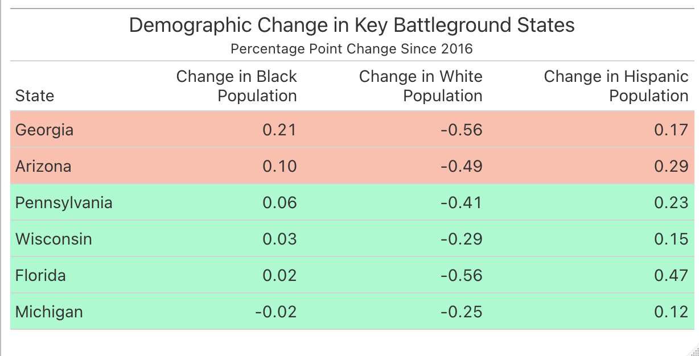

# Introduction and Model Recap

It's been a long semester, but we finally know the outcome of the 2020 presidential election. So how did my final prediction stack up against the actual results? To recap, I created a two-sided, unpooled ensemble model that predicted a separate vote share for both the Democratic and Republican candidate in each state. The predicted vote share for the Democratic or Republican candidate in each state was calculated based on the results of two equally weighted linear regressions, with the first regression using only polling data (using only polls conducted 2 weeks before the election or sooner) to predict vote share. The second regression used the vote share from the previous election, the change in the state's white population since the previous election, and whether or not the candidate's party has incumbency status to predict vote share. Ultimately, I predicted that Democrat Joe Biden would win **279** electoral votes to Republican Donald Trump's **259**, and the results of the actual election were not too far off, with Biden winning **306** electoral votes to Trump's **232**. Take a look below at the actual electoral vote totals versus my predicted totals:

  Actual EV Totals         |  Predicted EV Totals
:-------------------------:|:-------------------------:
  |  

In a winner-take-all system like the electoral college, where the winner of each state recieves all of its electoral votes (excluding Maine and Nebraska, the two states that can split their electoral votes), being able to predict the winner of each state is key to correctly predicting the winner of the presidency. Using my model, I was able to correctly predict the winner of every state besides for the states of Arizona and Georgia. Even though I predicted that Trump would win both Georgia and Arizona by a little over 6 percentage points, it looks like Biden will ultimately win both by less than one percentage point in each state. While it is probably fair to say that my model did a pretty good job predicting the winner in each state and even successfully predicted that Joe Biden would win the presidential election, it's worth investigating the error in my prediction and any trends within the logic of my model that contributed to incorrect predictions in Georgia and Florida in order to understand how to create a stronger model for future elections. 

  Actual Map         |  Predicted Map
:-------------------------:|:-------------------------:
  |  

# Model Error 

Because I used a two-sided model that produced a separate Democratic and Republican vote share prediction for each state, I decided to plot the error in my predictions in each state for both parties in order to better understand any clear trends in the error.

  Democratic Error        |  Republican Error
:-------------------------:|:-------------------------:
  |  

After considering these maps side-by-side, there are definitely some visually apparent trends in the error that are worth discussing. For starters, it seems as though the Republican vote share predictions were, on average, slightly more correct than the Democratic vote share predictions. However, it doesn't seem to be a very significant difference, and it's unlikely that a slight imbalance in the accuracy of the Democratic and Republican predictions was a major source of error in the model. Additionally, the states with the greatest and least error seem to be the same for both the Democratic and Republican predictions. Both New York and Oregon seem to be the states with the greatest error for both parties, and Washington state seems to be the state with the least error. It's also worth noting that it appears as though the average error in [battleground states](https://www.nytimes.com/interactive/2020/us/elections/electoral-college-battleground-states.html) is lower than the average error in non-battleground states for both Democratic and Republican predicted vote shares. Because of the historical trend of very small win margins in these states, this is a very good thing for my model, as these states ultimately ended up deciding the outcome of the election and thus accuracy in predicting them is key.

The table helps to precisely quantify many of the trends apparent in the map. On average, the predicted Republican vote shares were a little more accurate, but only by less than a percentage point. 

