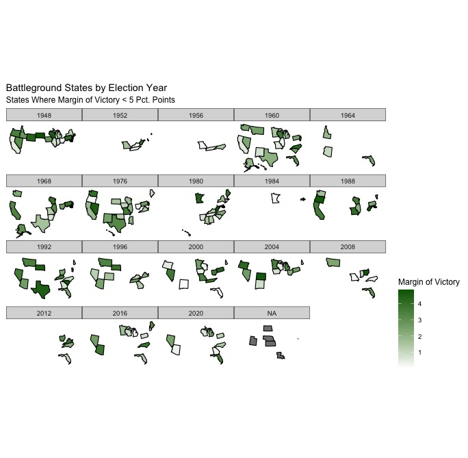
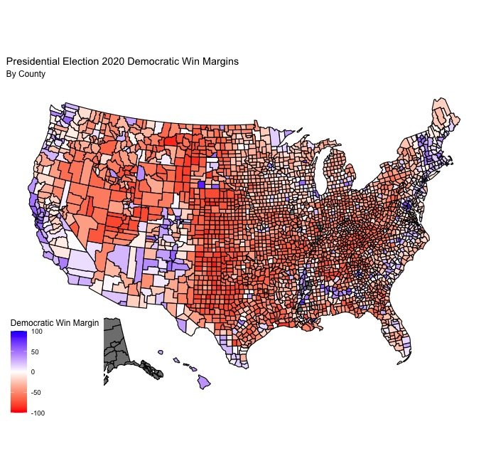

# Introduction

Over the course of the last few months, I have been focusing on building models to forecast the outcome of the 2020 presidential election. This week, however, I'll be using data to explore the validity of a salient media narrative surrounding the 2020 election; specifically, the idea that partisan polarization reached an all time high during the 2020 presidential election. In the weeks since the election, a variety of different [media outlets](https://news.wttw.com/2020/11/10/political-divide-2020-election-reaffirms-polarization-us), [magazines](https://time.com/5907318/polarization-2020-election/), and [quantitatively-oriented think tanks](https://www.pewresearch.org/fact-tank/2020/11/06/2020-election-reveals-two-broad-voting-coalitions-fundamentally-at-odds/) have written about the issue of increasing partisan polarization in the United States as shown through the results of said election. One shocking statistic from a [Pew Research Center poll](https://www.pewresearch.org/fact-tank/2020/11/13/america-is-exceptional-in-the-nature-of-its-political-divide/) shows that 89% of Trump supporters said they would be very concerned about the lasting damage a Biden presidency would cause to the United States, while 90% of Biden supporters similarly said they would be concered about the lasting damage a second Trump term would cause to the US.

It's clear there is substantial evidence regarding the rise of partisan polarization in the United States, but is it true that the 2020 election was one of the most polarizing ever? To investigate, I'll be taking a look at historical state and county level presidential election results to see if (1) a pattern of increasing partisan polarization is present in county-level election returns, and (2) if the 2020 election saw an unprecedented increase in partisan polarization relative to previous elections in modern US political history. These questions are important because of the potential implications for electoral politics, as political parties and candidates have a limited number of time/resources and thus need to figure out where to best spend them. If the US is becoming more polarized along partisan lines, that means that there are probably less places where candidates can be competitive, especially with an electoral system such as the electoral college. Ultimately, I find that 2020 marks a continuation of a longstanding pattern of increasing partisan polarization in presidential elections, but that 2020 does not necessarily seem to be the most polarizing election for both Democrats and Republicans. 

# State-Level Trends

To start, I wanted to explore the number of battleground states in presidential elections going all the way back to 1948. For the purposes of this visualization, I considered all states where the margin of victory was less than 5 percentage points to be battleground states. Theoretically, the existence of few battleground states and a relatively small pool of battleground states in any given period could indicate high partisan polarization, with more and more states becoming firmly "red" or "blue" states that consistently vote for the Democratic or Republican candidate in every election. As you can see from the chart, there is a far smaller pool of swing states in the elections that have occurred over the past two decades or so compared to the pool of swing states that existed in earlier elections, such as the presidential elections of 1976 or 1960. Looking at presidential elections from 1980 and earlier, the mean number of battleground states was 12 compared to an average of 8.6 for presidential elections occurring post-1980. Fittingly, the 2020 presidential election had 8 battleground states, but this is not the lowest of any presidential election in modern history. In the presidential election of 1984, a [massive blowout victory for then-President Reagan](https://www.270towin.com/1984_Election/), there were two battleground states, and there were 4 in the [2012 election](https://www.nytimes.com/elections/2012/results/president.html). Ultimately, looking at the generally declining number of battleground states can only tell us so much, as the winner-take-all electoral college system often gives the illusion of states leaning more uniformly partisan in one way or another. In fact, the deep [urban-rural political divide](https://source.wustl.edu/2020/02/the-divide-between-us-urban-rural-political-differences-rooted-in-geography/) that exists in the United States creates a dynamic where large, urban centers within states are bastions of Democratic support while more rural areas tend to support Republicans, making it important to analyze more granular data to capture the trends in partisan polarization in the US.

# Counties in 2020 and Historical Comparisons
In order to best study how partisan polarization has changed in the context of electoral politics, I'm going to look at county-level electoral results from presidential elections from 2000 to 2020. To start, here's a map of the Democratic win margins in counties across the United States in the 2020 presidential election.

# Conclusion
