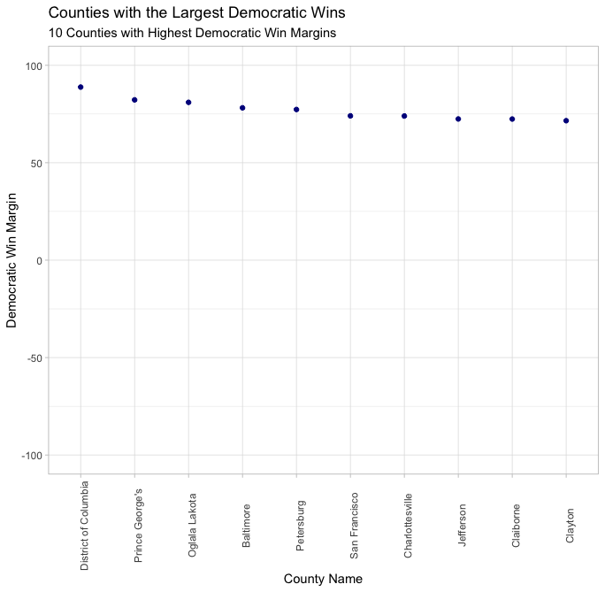

# Introduction

Over the course of the last few months, I have been focusing on building models to forecast the outcome of the 2020 presidential election. This week, however, I'll be using data to explore the validity of a salient media narrative surrounding the 2020 election; specifically, the idea that partisan polarization reached an all time high during the 2020 presidential election. In the weeks since the election, a variety of different [media outlets](https://news.wttw.com/2020/11/10/political-divide-2020-election-reaffirms-polarization-us), [magazines](https://time.com/5907318/polarization-2020-election/), and [quantitatively-oriented think tanks](https://www.pewresearch.org/fact-tank/2020/11/06/2020-election-reveals-two-broad-voting-coalitions-fundamentally-at-odds/) have written about the issue of increasing partisan polarization in the United States as shown through the results of said election. One shocking statistic from a [Pew Research Center poll](https://www.pewresearch.org/fact-tank/2020/11/13/america-is-exceptional-in-the-nature-of-its-political-divide/) shows that 89% of Trump supporters said they would be very concerned about the lasting damage a Biden presidency would cause to the United States, while 90% of Biden supporters similarly said they would be concered about the lasting damage a second Trump term would cause to the US.

It's clear there is substantial evidence regarding the rise of partisan polarization in the United States, but is it true that the 2020 election was one of the most polarizing ever? To investigate, I'll be taking a look at historical state (1948-2020) and county level (2000-2020) presidential election results to see if (1) a pattern of increasing partisan polarization is present in county-level election returns, and (2) if the 2020 election saw an unprecedented increase in partisan polarization relative to previous elections in modern US political history. These questions are important because of the potential implications for electoral politics, as political parties and candidates have a limited number of time/resources and thus need to figure out where to best spend them. If the US is becoming more polarized along partisan lines, that means that there are probably less places where candidates can be competitive, especially with an electoral system such as the electoral college. Ultimately, I find that 2020 marks a continuation of a longstanding pattern of increasing partisan polarization in presidential elections, but that 2020 does not necessarily seem to be the most polarizing election for both Democrats and Republicans. 

# State-Level Trends

To start, I wanted to explore the number of battleground states in presidential elections going all the way back to 1948. For the purposes of this visualization, I considered all states where the margin of victory was less than 5 percentage points to be battleground states. Theoretically, the existence of few battleground states and a relatively small pool of battleground states in any given period could indicate high partisan polarization, with more and more states becoming firmly "red" or "blue" states that consistently vote for the Democratic or Republican candidate in every election. As you can see from the chart, there is a far smaller pool of swing states in the elections that have occurred over the past two decades or so compared to the pool of swing states that existed in earlier elections, such as the presidential elections of 1976 or 1960. Looking at presidential elections from 1980 and earlier, the mean number of battleground states was 12 compared to an average of 8.6 for presidential elections occurring post-1980. Fittingly, the 2020 presidential election had 8 battleground states, but this is not the lowest of any presidential election in modern history. In the presidential election of 1984, a [massive blowout victory for then-President Reagan](https://www.270towin.com/1984_Election/), there were two battleground states, and there were 4 in the [2012 election](https://www.nytimes.com/elections/2012/results/president.html). Ultimately, looking at the generally declining number of battleground states can only tell us so much, as the winner-take-all electoral college system often gives the illusion of states leaning more uniformly partisan in one way or another. In fact, the deep [urban-rural political divide](https://source.wustl.edu/2020/02/the-divide-between-us-urban-rural-political-differences-rooted-in-geography/) that exists in the United States creates a dynamic where large, urban centers within states are bastions of Democratic support while more rural areas tend to support Republicans, making it important to analyze more granular data to capture the trends in partisan polarization in the US.

# Counties in 2020 and Historical Comparisons
In order to best study how partisan polarization has changed in the context of electoral politics, I'm going to look at county-level electoral results from presidential elections from 2000 to 2020. To start, here's a map of the Democratic win margins in counties across the United States in the 2020 presidential election (note: due to an unexpected issue, counties in Alaska were excluded from the visualization).

While it's hard to pick out any clear trends from this map alone, it does show the uneven distribution of partisan preferences across US counties. Most states have a number of blue and red counties, but it is apparent that there are literally more red counties than blue. Still, blue counties are disproportionately populated as compared to red counties, making the partisan preference in a given county alone less important than the margin of victory in that county (especially in a system like the electoral college, where the winner of a state's popular vote recieves all of that state's electoral votes). Given this, it makes sense to look at margins of victory in counties across the US, both in the 2020 election and across historical presidential elections, to learn more about partisan polarization. Here are the counties where the Democratic and Republican candidates had their strongest victories and losses, respectively:

  Democratic         |  Republican
:-------------------------:|:-------------------------:
  |  

Many of the counties that had the greatest Democratic win margins are from predictably Democratic bastions such as Washington D.C., San Fransico, and the Maryland D.C. suburbs, and many of the counties with the greatest Republican wins (and lowest Democratic win margins) are from predictably red areas such as rural Texas and Kansas. Still, Clayton County, Georgia, and King County, Washington show up as great examples of extremely partisan-leaning counties (Clayton going heavily for Democrats and King going heavily for Republicans) that exist within states that, historically, tend to vote for the opposite party. This demonstrates the importance of looking at data that is more granular than state-level data in order to understand partisanship in the context of electoral politics.

Accordingly, I decided to take a look at counties that continued to consistently vote for the Democratic or Republican party in elections from 2000-2020 in order to see the aggregate change in partisanship in Democratic-leaning and Republican-leaning counties over that 20 year period. Here are maps showing the change in the Democratic win margin from the 2000 to the recent 2020 presidential election in Democratic and Republican-leaning counties: 

  Democratic         |  Republican
:-------------------------:|:-------------------------:
  |  

As you can see, most of the Democratic-leaning counties had net larger win margins for the Democratic candidate in 2020 as compared to 2000, and the opposite is true for Republican-leaning counties and Republican candidates. You might notice several notable exceptions -- for Democrats, Miami-Dade had a smaller win margin in 2020 as compared to past years, and many counties in California that have consistently voted for Republicans even in the face of the growing strength of the Democratic party in the state saw larger Democratic win margins in 2020 as compared to 2000. Ultimately, counties that voted for Democrats in 2000 and 2020 saw a net increase of 7.5 in the Democratic win margin in those counties, and counties that voted for Republicans in 2000 and 2020 saw a net decrease of 18.8 percentage points in the Democratic win margin in those counties, suggesting that Democratic counties have generally become more strongly Democratic over the past two decades while Republican counties have generally become more strongly Republican over that same period.

The table shows several relevant metrics related to county-level partisan polarization, and helps to confirm some of the initial findings as displayed through the maps. First, the mean Democratic win margin has steadily decreased in Republican counties during each subsequent presidential election year (excluding 2008), and the mean Democratic win margin has concurrently increased in Democratic counties over the course of each election year. As mentioned, 2008 is a notable exception for the Republicans, and the small increase in the Democratic win margin in Republican counties that year may speak to the enormous popularity of Barack Obama as a presidential candidate or 2008. In any case, it is a small exception to the overall trend, which continues as normal following the 2008 election. These two trends also mean that the gap between the mean Democratic win margin in Republican and Democratic-leaning counties has necessarily increased each year, suggesting that the US electorate has become more polarized along partisan lines and that 2020 has represented a continuation of that process. 

However, did 2020 see the largest *spike* in partisan polarization compared to previous elections? In order to attempt to study this question, I looked at the shift in the Democratic win margin from the previous to the current presidential election from all presidential elections 2004-2020. I also made the distinction between Democratic and Republican-leaning counties, as I considered the possibility that different elections were more polarizing for either Democrats and Republicans, respectively, and all voters in the US are [probably not polarized in a monolithic fashion](https://www.theatlantic.com/politics/archive/2014/06/yes-polarization-is-asymmetric-and-conservatives-are-worse/373044/). For Democratic-leaning counties, the largest positive shifts in the average Democratic win margin occurred during the 2008 and 2020 elections, which is not particularly surprising. In 2008, Democrats had an enormously popular candidate running during the then-worst economic crisis in modern history in Barack Obama, and in 2020 Democrats were runnning against a [historically unpopular Republican president](https://fivethirtyeight.com/features/trump-is-the-most-unpopular-president-since-ford-to-run-for-reelection/) who is seen as [having mismanaged the federal government's response to the COVID-19 pandemic](https://www.vox.com/2020/6/8/21242003/trump-failed-coronavirus-response) while running for re-election. For Republican-leaning counties, the largest negative shift in the average Democratic win margin occurred during 2016, which makes sense considering the significant number of [previously Democratic voters who decided to vote for Donald Trump](https://www.nytimes.com/2017/03/28/upshot/a-2016-review-turnout-wasnt-the-driver-of-clintons-defeat.html) and the [low turnout of Democrats](https://www.pbs.org/newshour/politics/voter-turnout-2016-elections) during the 2016 elections. 

# Conclusion
It should be stressed that I am using county-level presidential election results, and indirectly, voting behavior as a way of measuring partisan polarization in the United States, and that there are certainly other approaches one could take to look at questions of partisanship that have nothing to do with electoral politics. However, my analysis suggests that the US population has generally become more partisan in terms of voting behavior, and 2020 was another example of that trend continuing in the same way it has historically. Still, it seems as though there is also evidence that elections are not uniformly polarizing for Democrats and Republicans in the same way, and that the 2008 and 2020 elections were more polarizing for Democrats while the 2016 election was more polarizing for Republicans.
